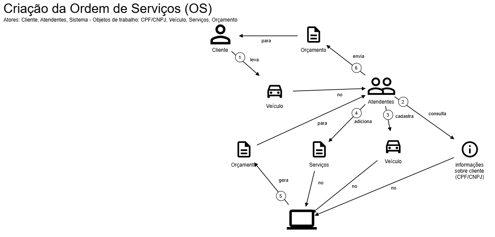
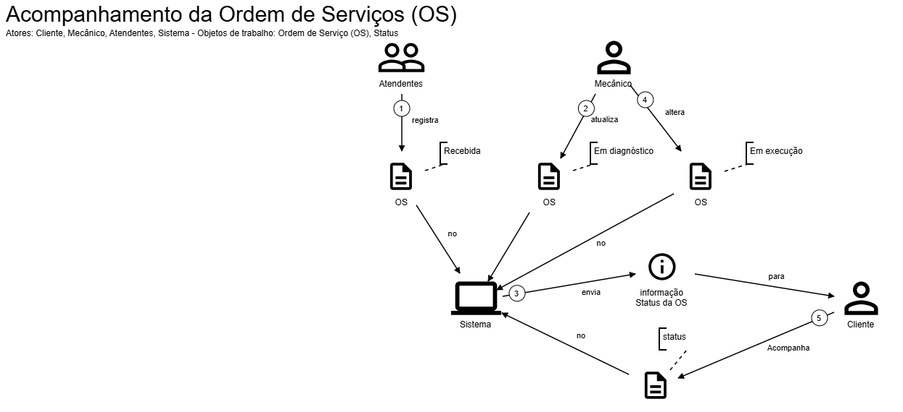
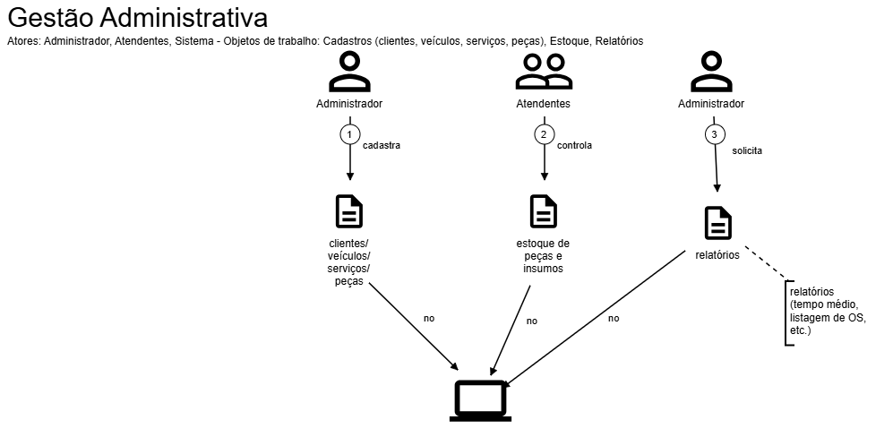

# Diagramas

- [Domain Storytelling](#domain-storytelling)

A parte de diagramas consiste em mostrar todos os diagramas que foram pedidos no requisito do projeto, desde o Domain Storytelling, Bounded Contexts e Event Storming.

Abaixo está o link para cada projeto no Miro, e logo abaixo algumas imagens que criamos para representar o Domain Storytelling.

- [Bounded Contexts](https://miro.com/app/board/uXjVJAySD60=/)
- [Event Storming](https://miro.com/app/board/uXjVJHQgVr0=/)

---

# Domain Storytelling

Criação da Ordem de Serviço (OS)

Atores: Cliente, Atendentes, Sistema
Objetos de trabalho: CPF/CNPJ, Veículo, Serviços, Orçamento

- História Pictográfica

1.	Cliente → leva veículo → Atendente
2.	Atendente → consulta/identifica cliente (CPF/CNPJ) → Sistema
3.	Atendente → cadastra veículo → Sistema
4.	Atendente → adiciona serviços solicitados → Sistema
5.	Sistema → gera orçamento (com peças/insumos) → Atendente
6.	Sistema → envia orçamento → Cliente
7.	Cliente → aprova/rejeita → Sistema 

---

Acompanhamento da OS

Atores: Cliente, Mecânico, Atendentes, Sistema
Objetos de trabalho: Ordem de Serviço, Status

História pictográfica:

1.	Atendentes → registra OS como "Recebida" → Sistema
2.	Mecânico → atualiza OS para "Em diagnóstico" → Sistema
3.	Sistema → envia status → Cliente
4.	Mecânico → altera status conforme execução ("Aguardando aprovação", "Em execução", "Finalizada") → Sistema
5.	Cliente → consulta status em tempo real → Sistema

---

Gestão Administrativa

Atores: Administrador, Atendentes, Sistema
Objetos de trabalho: Cadastros (clientes, veículos, serviços, peças), Estoque, Relatórios

História pictográfica:

1.	Administrador → cadastra clientes/veículos/serviços/peças → Sistema
2.	Atendentes → controla estoque de peças e insumos → Sistema
3.	Administrador → solicita relatórios → Sistema

