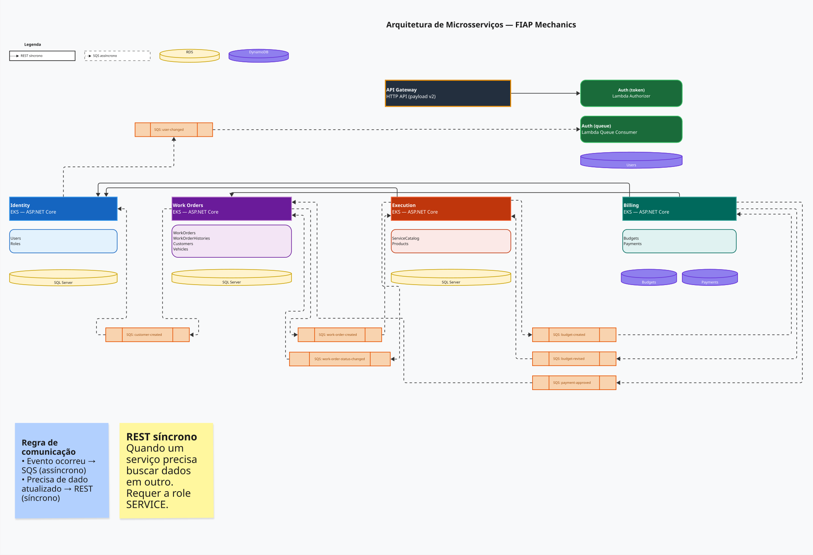

# Microsserviços

O sistema é composto por cinco componentes principais, cada um com responsabilidade bem delimitada e repositório independente.
O conjunto cobre desde a autenticação até a conclusão de uma ordem de serviço, passando por orçamento, pagamento e execução.

- [auth (serverless)](https://github.com/FIAP-POS-TECH-13SOAT-MECHANICS/mechanics-auth): Lambda Function para autenticação
- [billing](https://github.com/FIAP-POS-TECH-13SOAT-MECHANICS/mechanics-billing): controle de orçamentos e pagamentos
- [execution](https://github.com/FIAP-POS-TECH-13SOAT-MECHANICS/mechanics-execution): execução das ordens de serviço
- [identity](https://github.com/FIAP-POS-TECH-13SOAT-MECHANICS/mechanics-identity): cadastro e permissões de usuários
- [work-orders](https://github.com/FIAP-POS-TECH-13SOAT-MECHANICS/mechanics-work-orders): gestão de ordens de serviço

## `auth (serverless)`

Não se trata de um microsserviço convencional, mas de um conjunto de Lambda Functions que atua como autorizador do API Gateway.

Ao receber uma requisição, valida o CPF do solicitante, consulta o banco de dados e emite um JWT que os demais serviços utilizam para identificar o chamador. Por operar como serverless, não possui servidor dedicado nem ciclo de vida de aplicação: cada invocação é independente e efêmera.

## `billing`

Centraliza tudo que envolve dinheiro no ciclo de uma ordem de serviço.

Gera orçamentos a partir dos dados recebidos do `execution`, envia o orçamento para aprovação do cliente, registra a resposta (aprovação, rejeição ou expiração) e processa o pagamento via Mercado Pago.
Ao confirmar o pagamento, publica um evento que desencadeia as etapas seguintes [no fluxo do SAGA](./saga.md).

## `execution`

Gerencia a fila de execução física das ordens geradas.

Recebe o sinal de início de trabalho, acompanha o progresso pelas etapas de diagnóstico e reparo, e comunica a finalização ao `work-orders` ao término. Isola a lógica de produção das demais áreas do sistema, permitindo que a oficina opere de forma independente do fluxo administrativo.

## `identity`

Responsável pelo ciclo de vida dos usuários do sistema: cadastro, atualização de dados e controle de permissões.

Fornece as informações de identidade enviadas ao `auth` para consulta durante a autenticação. Enquanto o `auth` valida quem está acessando, o `identity` define quem existe e quais acessos cada usuário possui.

## `work-orders`

Ponto de entrada do fluxo operacional da oficina.

Registra a abertura de ordens de serviço, coordena as transições de status ao longo do SAGA coreografado e mantém o histórico de cada OS. Atua como o serviço central do domínio: os demais serviços reagem a eventos publicados por ele ou publicam eventos que ele consome para avançar o ciclo de vida da ordem.
