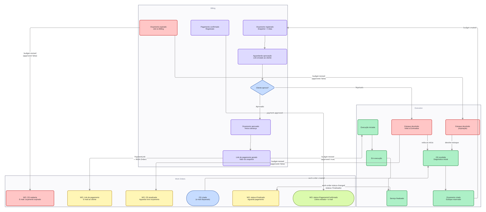

# Contratos de eventos

Mapeamento de todas as filas SQS do projeto, com producer, consumer e schema de cada evento.

As filas devem ser declaradas na camada `messaging` do [repositório de infraestrutura](https://github.com/FIAP-POS-TECH-13SOAT-MECHANICS/mechanics-infra).
Consulte a [documentação de mensageria](./messaging.md) para mais informações sobre a implementação.

## Filas declaradas

### `customer-created`

- **Producer:** `work-orders`
- **Consumer:** `identity`

Publicada ao cadastrar um cliente.

```csharp
public record CustomerCreatedEvent
{
    public required string FullName { get; init; }
    public required string CpfNumber { get; init; }
    public required string Email { get; init; }
    public required Guid CustomerId { get; init; }
    public required bool IsAdmin { get; init; }
}
```

### `user-changed`

- **Producer:** `identity`
- **Consumer:** `auth` (Lambda Queue Consumer)

O `identity` publica `user-changed` após processar o `customer-created` e criar o usuário.
Uma mensagem é disparada ao modificar dados do usuário (nome ou role) ou ao salvar alterações de senha.

Este evento contém dados de autenticação (`PasswordHash`, `SecurityStamp`) necessários para que o `auth` mantenha sua cópia sincronizada. Por esse motivo, deve ser consumido exclusivamente pelo `auth` - não exponha essa fila a outros serviços.

Em um projeto real, o acesso a esta fila seria restrito via IAM, garantindo que apenas o `auth` pudesse consumi-la. Por limitações da AWS Academy, não é possível criar roles e policies customizadas para esse controle.

O `auth` Lambda não usa `Mechanics.Infra.Messaging` - consome o SQS diretamente via Event Source Mapping no Terraform. O contrato de `user-changed` deve ser mantido compatível com o schema esperado pelo Lambda.

```csharp
public class UserChangedEvent(User user)
{
    public string Id { get; } = user.Id.ToString();
    public string CpfNumber { get; } = user.CpfNumber;
    public string FullName { get; } = user.FullName;
    public string Role { get; } = RoleSeeds.GetSeeds().First(role => role.Id == user.RoleId).Name;
    public string SecurityStamp { get; } = user.SecurityStamp;
    public string PasswordHash { get; } = user.PasswordHash;
    public string? CustomerId { get; } = user.CustomerId?.ToString();
    public DateTimeOffset LastUpdate { get; } = DateTimeOffset.Now;
}
```

### `work-order-created`

- **Producer:** `work-orders`
- **Consumer:** `execution`

Publicada ao criar uma nova OS.

```csharp
public record WorkOrderCreatedEvent
{
    public required Guid EventId { get; init; }
    public required DateTimeOffset OccurredAt { get; init; }
    public required Guid WorkOrderId { get; init; }
    public required Guid CustomerId { get; init; }
    public required Guid VehicleId { get; init; }
    public required string Status { get; init; }
    public Guid? CreatedByUserId { get; init; }
    public string? ReportedProblem { get; init; }
}
```

### `work-order-status-changed`

- **Producer:** `execution`
- **Consumer:** `work-orders`

Publicado pelo `execution` em toda alteração de status da OS: início da análise, conclusão da análise, aprovação ou rejeição do orçamento, início e conclusão do serviço. O `work-orders` atualiza seu estado interno com base neste evento e notifica o usuário.

```csharp
public record WorkOrderStatusChangedEvent
{
    public required Guid WorkOrderId { get; init; }
    public required Guid LastStatusChangeBy { get; init; }
    public required string OldStatus { get; init; }
    public required string NewStatus { get; init; }
    public required DateTimeOffset LastUpdate { get; init; }
}
```

### `budget-created`

- **Producer:** `execution`
- **Consumer:** `billing`

Publicado pelo `execution` quando o mecânico conclui a análise e monta o orçamento. O `billing` passa a ser o responsável pelo orçamento a partir deste evento, armazenando o snapshot dos itens e gerenciando o link de pagamento.

Os itens representam um snapshot dos preços no momento da análise - reajustes posteriores de produto ou serviço não afetam orçamentos já enviados.

```csharp
public record BudgetCreatedEvent
{
    public required Guid EventId { get; init; }
    public required DateTimeOffset OccurredAt { get; init; }
    public required Guid WorkOrderId { get; init; }
    public required Guid CustomerId { get; init; }
    public required Guid VehicleId { get; init; }
    public required decimal Total { get; init; }
    public required DateTimeOffset ExpiresAt { get; init; }
    public required IReadOnlyList<BudgetItem> Items { get; init; }
}

public record BudgetItem
{
    public required Guid Id { get; init; }
    public required string Name { get; init; }
    public required decimal UnitPrice { get; init; }
    public required int Quantity { get; init; }
    public required decimal Subtotal { get; init; }
}
```

### `budget-revised`

- **Producer:** `billing`
- **Consumer:** `execution`

`Approved: true` indica aprovação pelo cliente; `Approved: false` indica rejeição explícita ou expiração do prazo. `Notes` é um campo de texto livre preenchido pelo cliente ao aprovar ou rejeitar.

Quando aprovado, o `execution` pode iniciar o trabalho independentemente do pagamento. Quando rejeitado ou expirado, o veículo retorna para análise e um novo orçamento deve ser gerado, sujeito a reajuste de preços e disponibilidade de estoque.

```csharp
public record BudgetRevisedEvent
{
    public required Guid WorkOrderId { get; init; }
    public required bool Approved { get; init; }
    public string? Notes { get; init; }
    public required DateTimeOffset OccurredAt { get; init; }
}
```

### `payment-approved`

- **Producer:** `billing`
- **Consumer:** `work-orders`

Ao receber este evento, o `work-orders` marca a OS como paga, liberando a retirada do veículo. O pagamento ocorre em paralelo ao andamento do serviço - se a OS ainda não estiver finalizada, a retirada fica bloqueada até a conclusão.

```csharp
public record PaymentApprovedEvent
{
    public required Guid WorkOrderId { get; init; }
    public required DateTimeOffset PaidAt { get; init; }
}
```

## Visão por microsserviço



### `auth` (Lambda Queue Consumer)

| Fila           | Papel    |
|----------------|----------|
| `user-changed` | Consumer |

### `billing`

| Fila               | Papel    |
|--------------------|----------|
| `budget-created`   | Consumer |
| `budget-revised`   | Producer |
| `payment-approved` | Producer |

### `execution`

| Fila                        | Papel    |
|-----------------------------|----------|
| `budget-created`            | Producer |
| `budget-revised`            | Consumer |
| `work-order-created`        | Consumer |
| `work-order-status-changed` | Producer |

### `identity`

| Fila               | Papel    |
|--------------------|----------|
| `customer-created` | Consumer |
| `user-changed`     | Producer |

### `work-orders`

| Fila                        | Papel    |
|-----------------------------|----------|
| `customer-created`          | Producer |
| `payment-approved`          | Consumer |
| `work-order-created`        | Producer |
| `work-order-status-changed` | Consumer |