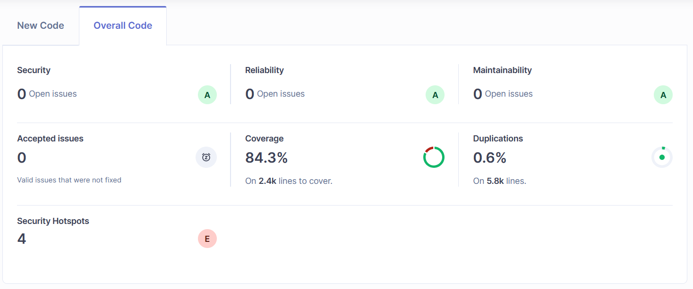
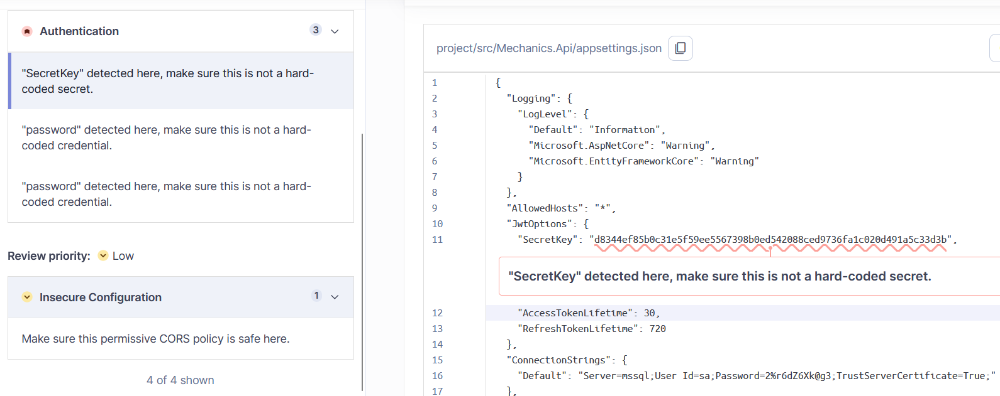
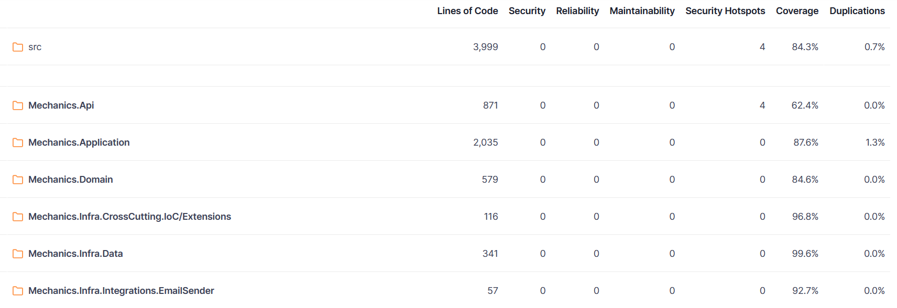

# SonarQube

Imagens do relatório gerado pela ferramenta.

## Visão geral

A tela inicial do Sonar mostra um resumo da análise. Não há nenhuma issue aberta e todas as sugestões foram implementadas. O Coverage total do projeto ficou em 84%.

## Segurança

O Sonar apontou algumas informações sensíveis no arquivo `appsettings.json`. Devido à configuração do projeto (simplificada para rodar direto pelo docker-compose), esses dados ficaram visíveis.
Em um projeto em produção, essas informações estariam em uma key-vault e seriam substituídas pela esteira de CI/CD.

Há também um alerta sobre a configuração de CORS. O correto seria ajustar essa opção de acordo com a URL do front-end da aplicação (limitando o acesso via browser ao domínio especificado), mas como o projeto é somente uma API, não é um problema no momento.

## Cobertura de código

A última imagem mostra a tela de coverage do Sonar. As camadas do projeto ficaram todas com pelo menos 80% de cobertura, com exceção da API (controllers), que ficou com 62%.

As camadas de domínio e aplicação, que implementam todas as regras de negócio e validações do projeto, foram devidamente cobertas por testes unitários ou de integração.
Há também pelo menos um teste de integração para cada controller e fluxos de exceção (middlewares), garantindo que a API consiga chamar a camada de aplicação corretamente.

