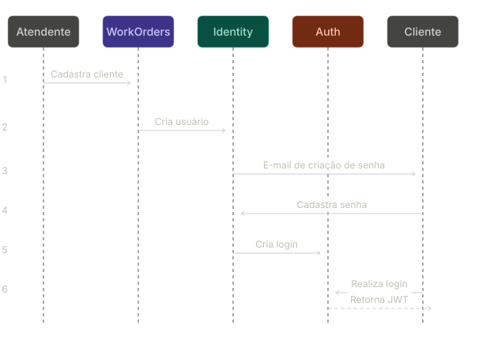
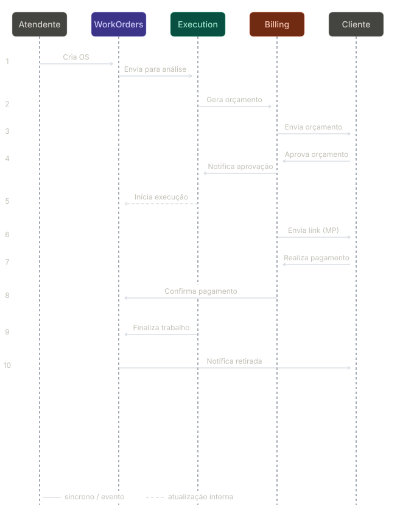
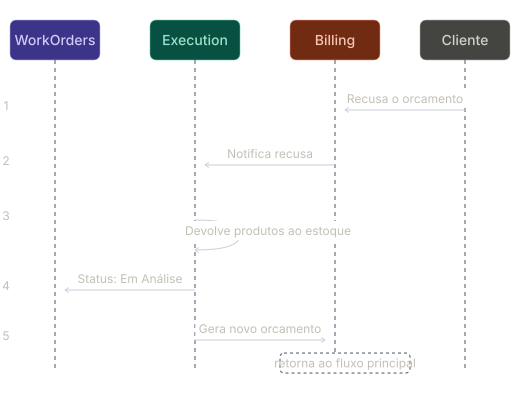

# Fluxos SAGA

A implementação segue o padrão **coreografado**: cada microsserviço reage a eventos publicados por outros serviços, sem a necessidade de um orquestrador central.

A escolha se justifica pela simplicidade operacional. A integração é feita diretamente via AWS SDK, sem dependências de bibliotecas de mensageria de terceiros.
O SDK já oferece retry automático para falhas de comunicação com a API da AWS, o que reduz a necessidade de lógica de resiliência adicional na aplicação.

As filas SQS são provisionadas na camada `messaging` do [repositório de infraestrutura](https://github.com/FIAP-POS-TECH-13SOAT-MECHANICS/mechanics-infra).
Para cada fila principal existe uma fila de mensagens mortas (DLQ) associada.
Após 3 tentativas sem confirmação de processamento, a mensagem é encaminhada automaticamente para a DLQ, onde fica retida por 14 dias para análise e reprocessamento manual.

Os contratos e a definição de cada fila estão documentados em [Filas](./queues.md).

## Criação de usuário

1. **Atendente -> WorkOrders:** cadastra o cliente no sistema.
2. **WorkOrders -> Identity:** cria o usuário vinculado ao cliente.
3. **Identity -> Cliente:** envia e-mail com link para criação de senha.
4. **Cliente -> Identity:** cadastra a senha por meio do link recebido.
5. **Identity -> Auth:** cria o login do usuário.
6. **Cliente -> Auth:** realiza o primeiro login com a senha cadastrada.

> Clientes PJ recebem uma conta com a role `CustomerAdmin`, que permite cadastrar outros usuários com a role `CustomerUser`. Clientes PF recebem apenas uma conta `CustomerUser`.

## Fluxo de ordem de serviço

1. **Atendente -> WorkOrders:** cadastra o cliente, o veículo e abre a ordem de serviço.
2. **WorkOrders -> Execution:** envia a OS para análise e diagnóstico.
3. **Execution -> Billing:** gera o orçamento após o diagnóstico.
4. **Billing -> Cliente:** envia o orçamento para aprovação.
5. **Cliente -> Billing:** aprova o orçamento.
6. **Billing -> Execution:** notifica a aprovação para início da execução.
7. **Execution -> WorkOrders:** atualiza o status da OS para "em execução".
8. **Billing -> Cliente:** envia o link de pagamento via Mercado Pago.
9. **Cliente -> Billing:** realiza o pagamento.
10. **Billing -> WorkOrders:** confirma o pagamento.
11. **Execution -> WorkOrders:** notifica a finalização do trabalho.
12. **WorkOrders -> Cliente:** notifica que o veículo está disponível para retirada.

## Orçamento recusado

1. **Cliente -> Billing:** recusa o orçamento.
2. **Billing -> Execution:** notifica a recusa.
3. **Execution -> Execution:** devolve os produtos reservados ao estoque, incrementando a quantidade disponível de cada item.
4. **Execution -> WorkOrders:** atualiza o status da OS para "EmAnalise".
5. **Execution -> Billing:** gera um novo orçamento revisado, reiniciando o fluxo principal a partir do passo 3.
