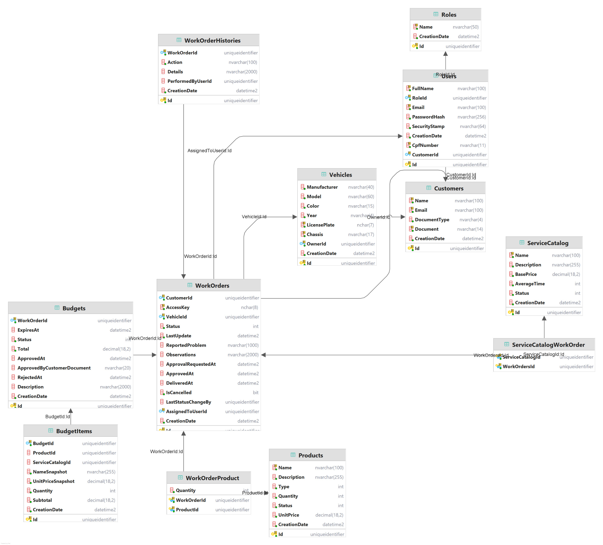

# Decisões técnicas

## Architecture Decision Records (ADRs)

### ADR 001 — Padrão de Comunicação REST

**Data:** 2026-03-23
**Status:** Aceito

**Contexto:**
A aplicação precisa de um padrão de comunicação simples, amplamente suportado e fácil de testar.

**Decisão:**
Adotar o padrão REST para todos os endpoints da aplicação.

**Alternativas consideradas:**

- gRPC: mais performante, mas exige maior complexidade.
- GraphQL: flexível, mas não necessário para o escopo atual.

**Consequências:**

- Endpoints organizados por recurso (/api/clients, /api/vehicles, etc.)
- Uso de verbos HTTP (GET, POST, PUT, DELETE)
- Facilidade de integração com Swagger e Postman

### ADR 002 — Uso de HPA no Kubernetes

**Data:** 2026-03-23
**Status:** Aceito

**Contexto:**
A aplicação precisa escalar automaticamente conforme a demanda.

**Decisão:**
Utilizar Horizontal Pod Autoscaler (HPA) no cluster EKS para escalar pods com base em métricas de CPU e memória.

**Alternativas consideradas:**

- Escalonamento manual: menos eficiente.
- Escalonamento por tempo: não responde a picos imprevisíveis.

**Consequências:**

- Monitoramento contínuo via Metrics Server
- Configuração de limites e limiares no manifesto do HPA
- Redução de custos e aumento de disponibilidade

### ADR 003 — Separação por Ambientes

**Data:** 2026-03-23
**Status:** Aceito

**Contexto:**
O projeto precisa ser executado em ambientes distintos para testes, homologação e produção.

**Decisão:**
Separar os ambientes em `dev`, `stg` e `prod`, com configurações específicas para cada um.

**Alternativas consideradas:**

- Ambiente único com variáveis: risco de conflitos.
- Ambientes manuais: difícil de manter e escalar.

**Consequências:**

- Deploys independentes via CI/CD
- Banco de dados isolado por ambiente
- Monitoramento e logs segmentados

## Request for Comments (RFCs)

### RFC 001 — Escolha da Nuvem

**Data:** 2026-03-23
**Status:** Aceito

**Contexto:**
O projeto exige provisionamento automatizado, escalabilidade e integração com serviços gerenciados.

**Decisão:**
Adotar *AWS* como plataforma de nuvem, utilizando EKS, RDS e ECR.

**Alternativas consideradas:**

- Azure: boa integração com .NET, mas menos acessível no plano educacional.
- GCP: simples para deploy, mas menor suporte para Kubernetes avançado.

**Consequências:**

- Uso de Terraform para provisionamento
- Deploy em EKS com imagens no ECR
- Banco de dados via RDS SQL Server

### RFC 002 — Estratégia de Autenticação

**Data:** 2026-03-23
**Status:** Aceito

**Contexto:**
A aplicação exige autenticação segura e flexível para múltiplos perfis.

**Decisão:**
Utilizar cadastro próprio com geração de tokens *JWT* via Lambda Function.

**Alternativas consideradas:**

- OAuth2: robusto, mas complexo para o escopo atual
- Sessões com cookies: menos seguro e escalável

**Consequências:**

- Tokens com tempo de expiração configurável
- Middleware para validação em cada endpoint
- Serviço de autenticação de alta escalabilidade

### RFC 003 — Banco de Dados

**Data:** 2026-03-23
**Status:** Aceito

**Contexto:**
O modelo relacional exige suporte a joins complexos e integridade referencial.

**Decisão:**
Utilizar *SQL Server Express* hospedado no RDS da AWS.

**Alternativas consideradas:**

- PostgreSQL: excelente para modelagem, mas menos familiar à equipe
- MongoDB: não atende bem ao modelo relacional exigido

**Consequências:**

- Diagrama ER com normalização
- Scripts de criação e migração via EF Core
- Monitoramento de performance via CloudWatch

## Banco de dados

Optamos por utilizar um banco de dados relacional para garantir a consistência e integridade das informações, já que o sistema envolve diversas entidades relacionadas, como clientes, veículos, ordens de serviço e produtos.

O Microsoft SQL Server foi escolhido por conta da facilidade de integração com aplicações C#/.NET, oferecendo suporte nativo a bibliotecas como Entity Framework. A versão Express é gratuita e suporta uma base de dados de até 10 GB, o que é condizente para o escopo do projeto.

Além disso, o SQL Server apresenta um bom desempenho mesmo em ambientes de menor porte, com recursos como cache de consultas e otimização automática de índices. Isso o torna uma escolha mais completa em comparação com alternativas menores, como o MySQL, especialmente em um contexto de aplicação C#.

## Notificações por e-mail

Para o ambiente de desenvolvimento, o sistema utiliza a ferramenta [MailPit](mailpit.axllent.org). Ela fornece um servidor SMTP para simular o envio de mensagens.

Todos os e-mails enviados podem ser acessados pelo cliente web da ferramenta, que roda na porta [8025](http://localhost:8025/).
