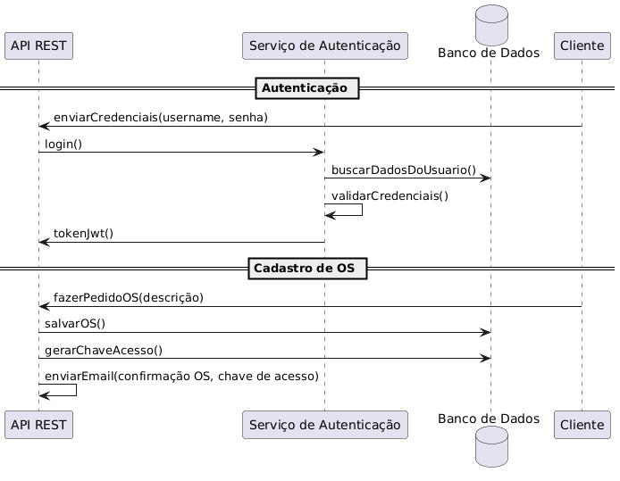

# Resumo do fluxo de Ordem de Serviço

- Atores: Cliente, Atendente, Mecânico, Sistema e Serviço de Notificação.
- Objetivo: Receber veículo, diagnosticar, gerar orçamento, obter aprovação do cliente, executar e finalizar serviço e, por fim, devolver veículo.

## Descrição detalhada

1. Cadastro

- O usuário cadastra o cliente e o veículo no sistema.
- É obrigatório informar um endereço de e‑mail válido para envio das notificações.

1. Abertura da OS

- O atendente registra a OS com o problema relatado.
- O sistema gera automaticamente uma chave/código de acesso e envia um e‑mail ao cliente com o código e instruções para acompanhamento.

1. Análise / Orçamento

- O mecânico realiza o diagnóstico e registra no sistema os produtos e serviços necessários (itens do orçamento).
- Ao finalizar a análise, o sistema envia um e‑mail ao cliente informando que a OS está aguardando aprovação, com resumo do orçamento.

1. Aprovação

- O cliente acessa a OS usando CPF/CNPJ e a chave de acesso enviada por e‑mail.
- O cliente aprova ou rejeita o orçamento:
- Se aprovar, o sistema notifica a oficina e libera a execução.
- Se rejeitar, o cliente pode registrar observações e a OS retorna para nova análise.

1. Execução

- Com o orçamento aprovado, o mecânico atualiza a OS e começa a realizar o serviço.
- Ao concluir, o mecânico registra a finalização no sistema.
- O sistema notifica o cliente que o veículo está pronto para retirada.

1. Devolução / Encerramento

- O cliente retira o veículo; o atendente confere e encerra a OS.
- O sistema envia um e‑mail final ao cliente confirmando a entrega.

## Endpoints e perfis por etapa

| Fluxo OS | Endpoint | Perfil | Observações |
| --- | --- | --- | --- |
| Cadastro e abertura | `POST /api/WorkOrders` | Usuários autenticados* | Cria a OS, status `Received` e dispara o e-mail com a chave de acesso. |
| Análise / Orçamento | `POST /api/WorkOrders/{id}/assign` | Atendente ou Administrador | Atribui a OS a um mecânico e pode avançar o status para `UnderDiagnosis`. |
| Análise / Orçamento | `POST /api/WorkOrders/{id}/request-approval` | Atendente ou Administrador | Sinaliza que o orçamento está pronto `PendingApproval` e aciona a notificação ao cliente. |
| Execução | `POST /api/WorkOrders/{id}/start` | Mecânico ou Administrador | Após aprovar o orçamento, altera o status para `InProgress`, indicando início dos trabalhos. |
| Execução | `POST /api/WorkOrders/{id}/complete` | Mecânico ou Administrador | Marca a OS como `Completed` após finalizar os reparos. |
| Encerramento | `POST /api/WorkOrders/{id}/deliver` | Atendente ou Administrador | Registra a retirada do veículo e encerra a OS `Delivered`. |
| Cliente | `GET /api/WorkOrders/track?document=&accessKey=` | Anônimo (cliente) | Consulta pública da OS usando documento e chave enviados por e-mail. |
| Cliente | `POST /api/work-orders/approve-budget` | Anônimo (cliente) | Recebe documento e chave para aprovar o orçamento. |
| Cliente | `POST /api/work-orders/reject-budget` | Anônimo (cliente) | Registra a rejeição e possibilita comentários do cliente. |
| Gerenciamento | `GET /api/WorkOrders/{id}/services/average-time` | Usuários autenticados* | Consulta o tempo médio estimado dos serviços aprovados. |
| Gerenciamento | `POST /api/WorkOrders/{id}/status` | Usuários autenticados* | Permite outras transições de status com justificativa. |
| Gerenciamento | `PUT /api/WorkOrders/{id}` | Usuários autenticados* | Atualiza itens de produtos/serviços e observações do diagnóstico. |
| Gerenciamento | `GET /api/WorkOrders/{id}` | Usuários autenticados* | Recupera os detalhes da OS para prosseguir com o atendimento. |
| Gerenciamento | `GET /api/WorkOrders` | Usuários autenticados* | Recupera OS para acompanhamento interno |

> Usuários autenticados: (Atendente, Administrador ou Mecânico)

## Fluxo de atendimento

1. Cadastro do cliente
2. Cadastro do veículo
3. Geração da ordem de serviço *
4. Análise pelo mecânico
5. Envio do orçamento *
6. Aprovação pelo cliente
7. Realização do serviço
8. Devolução do veículo *

\* passos que geram notificação ao cliente

Quando um novo cliente chega ao estabelecimento, ele é cadastrado, juntamente com os dados do veículo. É necessário informar um endereço de e-mail para o envio das notificações.

Após o cadastro, um funcionário gera a ordem de serviço informando o problema relatado. É disparado um e-mail com um código de acesso da ordem de serviço que o cliente poderá utilizar para consultar o andamento.

Após análise, um mecânico lança os produtos e serviços no sistema e um novo e-mail é enviado para o cliente informando que a ordem está aguardando aprovação. O cliente pode consultar a ordem utilizando seu documento (CPF ou CNPJ) e a chave de acesso gerada e então aprovar ou rejeitar o serviço.

O serviço então é realizado e o cliente recebe outra notificação informando que o veículo está pronto para ser retirado. Um último e-mail é enviado quando o veículo for retirado e a ordem de serviço encerrada.

## Diagramas

### Login

### Ordem de Serviço

