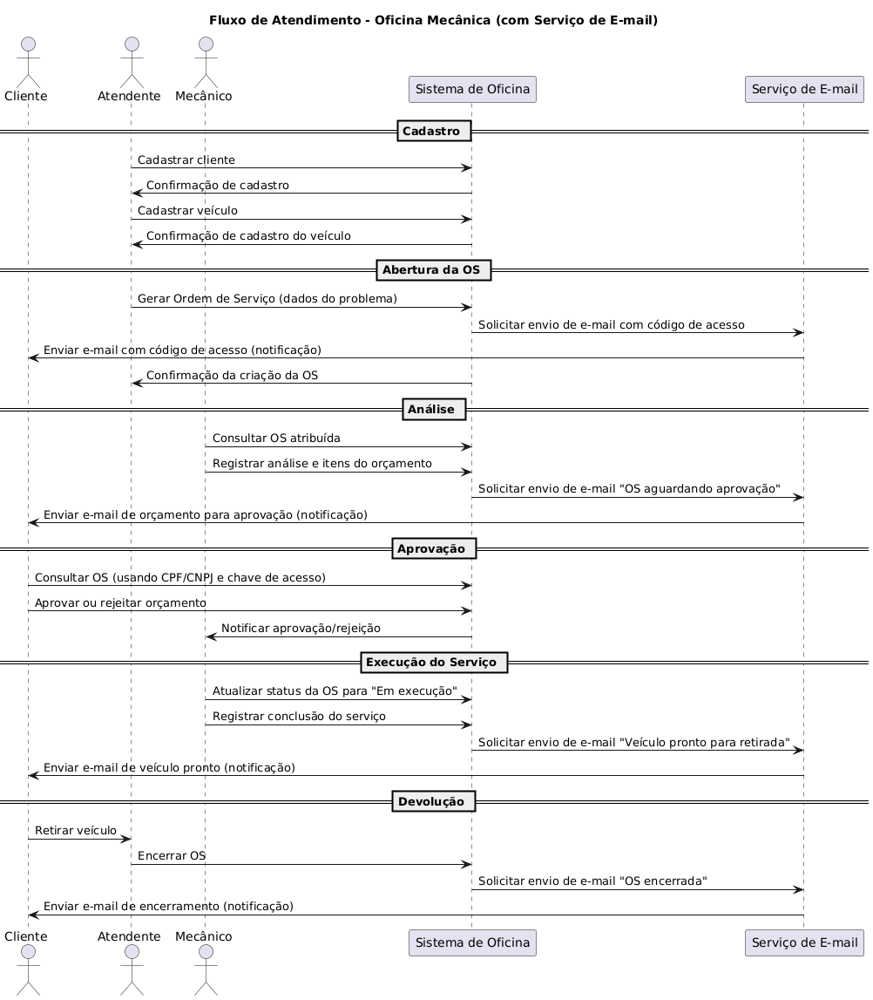

Resumo do fluxo de Ordem de Serviço.

Atores: Cliente, Atendente, Mecânico, Sistema e Serviço de Notificação.
Objetivo: Receber veículo, diagnosticar, gerar orçamento, obter aprovação do cliente, executar e finalizar serviço e, por fim, devolver veículo. 

####Descrição

Quando um novo cliente chega ao estabelecimento, o atendente realiza o cadastro do cliente e do veículo no sistema.
É obrigatório informar um endereço de e‑mail válido para que o cliente receba as notificações referentes à ordem de serviço.
Em seguida, o atendente gera a Ordem de Serviço (OS) registrando o problema relatado.
Automaticamente é gerada uma chave/código de acesso e o sistema envia um e‑mail para o cliente contendo esse código e instruções para acompanhamento da OS.
O veículo passa então para análise do mecânico, que realiza o diagnóstico e registra no sistema os produtos e serviços necessários, formando o orçamento. 
Ao finalizar a análise, o sistema envia um novo e‑mail ao cliente informando que a OS está aguardando aprovação, com o resumo do orçamento e como proceder para aprovar ou rejeitar.
O cliente acessa a OS utilizando seu documento (CPF/CNPJ) e a chave de acesso enviada por e‑mail, e opta por aprovar ou rejeitar o orçamento. 
Em caso de aprovação, o sistema notifica a oficina e libera o início do serviço. 
Se rejeitado, o cliente pode registrar observações. Dessa forma à mecânica pode reavaliar a OS, logo, volta para análise.
Com o orçamento aprovado, o mecânico executa o serviço e, quando concluído, registra a finalização no sistema. 
O cliente recebe uma nova notificação informando que o veículo está pronto para retirada.
Por fim, o cliente retira o veículo; o atendente confere a entrega e encerra a OS no sistema. 
Ao encerrar a ordem, é enviado um e‑mail final ao cliente sinalizando entrega do véiculo.

Resumo diagrama: A OS é aberta pelo atendente com base no relato do cliente. O mecânico avalia o veículo e registra o orçamento para aprovação do cliente. Após aprovação, o mecânico realiza o serviço; o cliente retira o veículo e o atendente encerra a OS. Nos passos marcados com * o sistema envia notificações por e‑mail ao cliente.
